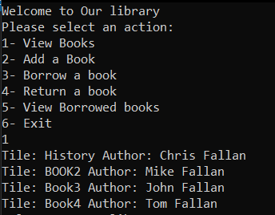
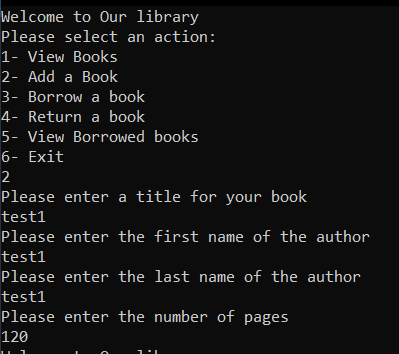
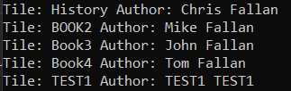
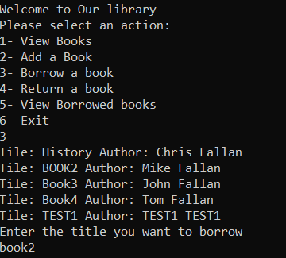
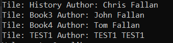
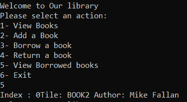
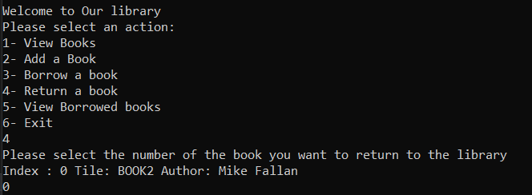
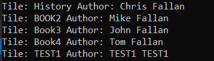

# lab08-Collections

This app represents a library that allows you to borrow books and return them

We have 3 classes and 2 interfaces:

The classes are:

1. Book
2. Library
3. Backpack

The interfaces are:.

1. Ibag
2. ILibrary

In Class Library these methods:

- Add: it adds a book to the library
- Borrow: it removes the book from the library 
- Return: it returns the book back to the library
- GetEnumerator: it iterates over the books

In class Book we have these properties:

- title
- firstName
- lastName
- numberOfPages

In class Backpack we have these methods:

- Pack: to add a borrowed book
- Unpack: to remove a borrowed book

## Demo

In this image we viewed all books

We added a book called Test1

and we can see Test1 added to the books here

Here we borrowed book2

And we no longer see it in the library list

but we can find it in the Borrowed books list

here we chose to return it back to the library

and now we can see it in the library

